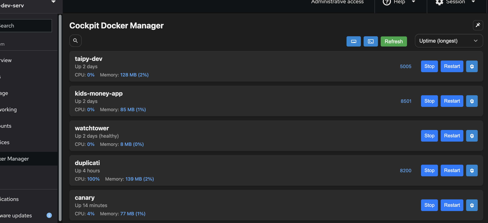

<h1 align="center">🐳 Cockpit Docker Manager</h1>
  
**Docker Manager** is a lightweight and intuitive utility designed to help you manage your Docker containers via a simplified interface. Whether you're a system administrator, developer, or DevOps engineer, DockerManager makes container visibility and management easier and more accessible.

---

<div align="center">
  
</div>

---

## 🚀 Features

- ✅ List, start, stop, search and restart containers
- 🔍 View container status, uptime, details and exposed ports
- 💻 In window terminal (now with individual container terminal functionality)
- 💾 Image management

## 🛠️ Installation

### Ubuntu:

```shell
curl -L -o dockermanager.deb https://github.com/chrisjbawden/cockpit-dockermanager/releases/download/latest/dockermanager.deb && sudo dpkg -i dockermanager.deb
```
### Fedora/RHEL:

```shell
curl -sSL https://raw.githubusercontent.com/chrisjbawden/cockpit-dockermanager/main/install-fedora.sh | bash
```

---

### Changelog

#### v1.0.X
- Fix for stats
- Banner converted to toast notification
- bugfix for prunning button

#### v1.0.7

- Added modal to wrap logs, details and individual container terminal functionality
- Minor UI changes
- Added ability to delete containers

#### v1.0.6

- Added functionality to pin/fix header
- Added functionality to delete images
- Resource stats update pushed to background

#### v1.0.5

- Added "sort-by" functionality
- Added search functionality
- Fixed terminal button
- Modified refresh interval to 3mins

<div align="center">
  <a href="https://chrisjbawden.github.io/cockpit-dockermanager/" target="_blank" rel="noopener noreferrer">...</a>
</div>
